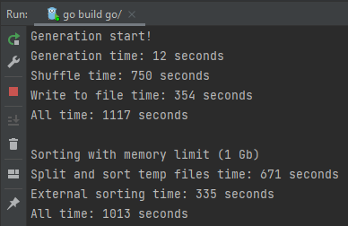
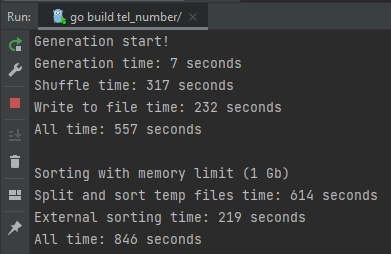
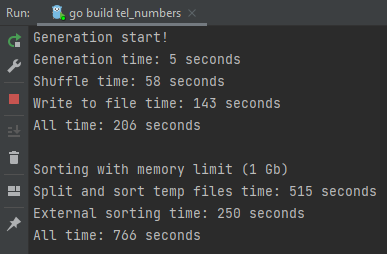

# Golang realization of tel_number

## Sorting algorithm with RAM limit
1. Split one file to several temporary files;
2. Sort numbers in each temporary file;
3. Using external sorting and write result to output file.

## Files
* `generator.go` - generation, shuffling and writing to file all phone numbers;
* `main.go` - main fail to start program;
* `sorter.go` - variants of number sorting - with(-out) RAM limit, SQL-sorting;
* `results` - directory with PNG of program's results.

## Results
1. i5-4460 4-core CPU, 8Gb RAM, **HDD**
   
2. i5-4460 4-core CPU, 8Gb RAM, **SSD**
   
3. i7-4702MQ 8-core CPU, 16Gb RAM, **SSD**
   

### Analysis
With increasing RAM memory size generation time decreases when running on one core with ~ 3.2GHz.

### Some problems
While splitting input file to several files, we can receive extra number `8936`, I can't catch this element while generation and writing to input file.